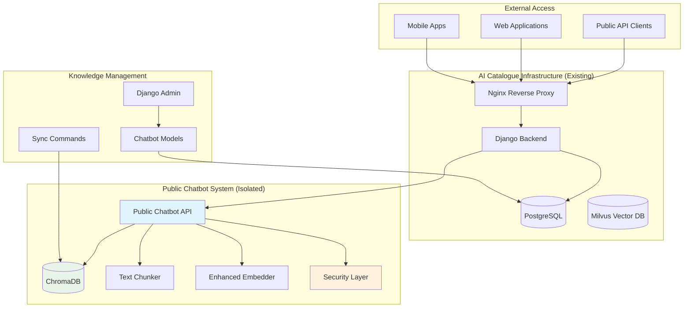
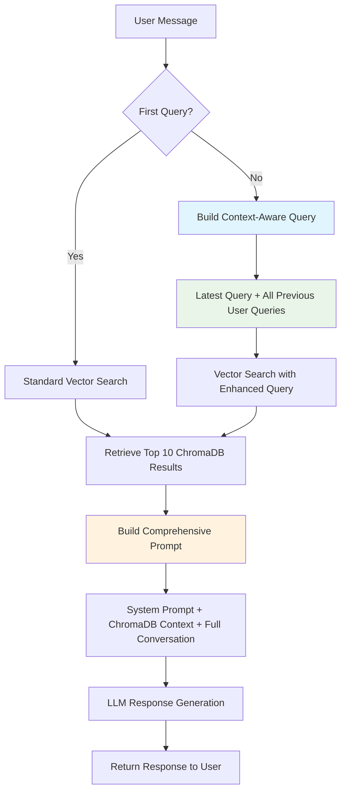
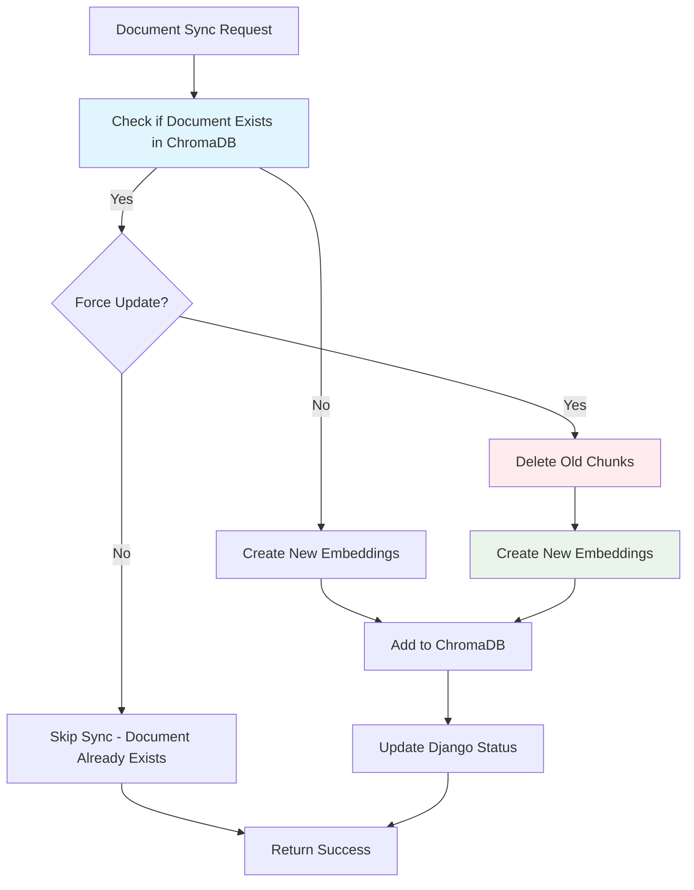
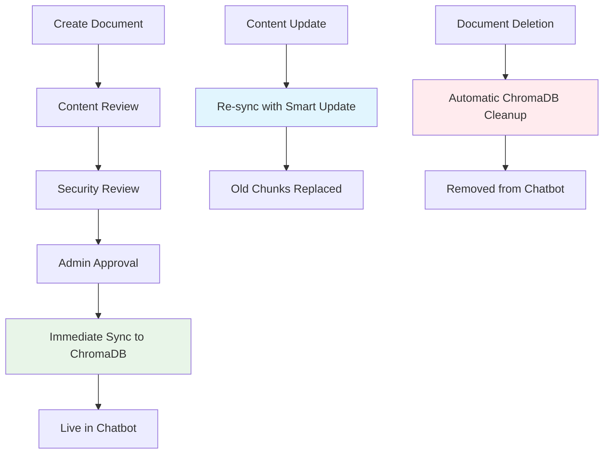

# 🤖 Public Chatbot Architecture Documentation

## Table of Contents
- [Overview](#overview)
- [Architecture Components](#architecture-components)
- [Security & Isolation](#security--isolation)
- [Advanced Text Processing](#advanced-text-processing)
- [Conversation-Aware Workflow](#conversation-aware-workflow)
- [Smart Embedding Management](#smart-embedding-management)
- [Configurable System Prompts](#configurable-system-prompts)
- [API Documentation](#api-documentation)
- [Database Schema](#database-schema)
- [Django Admin Interface](#django-admin-interface)
- [Deployment Guide](#deployment-guide)
- [Configuration Options](#configuration-options)
- [Monitoring & Analytics](#monitoring--analytics)
- [Troubleshooting](#troubleshooting)
- [Performance Optimization](#performance-optimization)

## Overview

The **Public Chatbot System** is a completely isolated, production-ready AI chatbot API designed to provide public access to approved knowledge without compromising the security of your main AI Catalogue system. It features advanced text chunking, enhanced embedding models, and enterprise-grade security controls.

### Key Features
- ✅ **Complete Isolation**: Zero impact on existing AI Catalogue system
- ✅ **Advanced Text Processing**: Professional chunking with large document support (750 token overlap)
- ✅ **Enhanced AI Models**: Upgraded embedding models with 2x capacity
- ✅ **Conversation-Aware**: Context accumulation with intelligent vector search
- ✅ **Smart Sync**: Duplicate prevention and automatic embedding updates
- ✅ **Configurable System Prompts**: Customizable AI personality and behavior
- ✅ **Immediate Sync**: Real-time document processing through Django admin
- ✅ **Enterprise Security**: Rate limiting, prompt injection protection, abuse monitoring
- ✅ **Production Ready**: Docker deployment, health monitoring, analytics
- ✅ **Admin Controlled**: Comprehensive Django admin interface
- ✅ **Scalable**: ChromaDB vector database with persistent storage

## Architecture Components

### System Architecture Diagram



### Component Details

#### 1. Public Chatbot API (`backend/public_chatbot/`)
**Main API endpoint providing isolated chatbot functionality with conversation awareness**

```
backend/public_chatbot/
├── __init__.py
├── apps.py                    # Django app configuration with signal registration
├── models.py                  # Database models (isolated) + system prompt config
├── views.py                   # API endpoints with conversation context support
├── services.py                # ChromaDB service with smart sync capabilities
├── llm_integration.py         # LLM service with configurable system prompts
├── chunking.py               # Advanced text chunking system (750 token overlap)
├── embedding_strategies.py   # Large chunk embedding system
├── signals.py                # Automatic ChromaDB cleanup on document deletion
├── admin.py                  # Django admin with immediate sync actions
├── urls.py                   # URL routing
└── management/
    └── commands/
        ├── init_sample_knowledge.py    # Initialize sample data
        └── sync_public_knowledge.py    # Smart sync to ChromaDB
```

#### 2. Vector Database Layer
**ChromaDB for isolated public knowledge storage**

- **Database**: ChromaDB (port 8001)
- **Isolation**: Completely separate from Milvus (port 19530)
- **Storage**: Persistent Docker volume (`chromadb_data`)
- **Collections**: Single `public_knowledge_base` collection

#### 3. AI Processing Pipeline
**Advanced text processing with multiple strategies**

```python
# Text Processing Flow
Document Input → Chunking → Embedding → Vector Storage → Search
```

## Security & Isolation

### Complete System Isolation

#### Database Isolation
```python
# Separate databases - no cross-contamination
Main System:
  - PostgreSQL: ai_catalogue tables
  - Milvus: Private document vectors (port 19530)

Public Chatbot:
  - PostgreSQL: public_chatbot_* tables (no foreign keys)
  - ChromaDB: Public knowledge vectors (port 8001)
```

#### Authentication Isolation
```python
# Public chatbot bypasses ALL authentication
Main System Endpoints:           Public Chatbot:
/api/projects/     [AUTH REQ]    /api/public-chatbot/  [NO AUTH]
/api/documents/    [AUTH REQ]    /api/public-chatbot/health/ [NO AUTH]
/admin/           [AUTH REQ]    /admin/public_chatbot/ [ADMIN ONLY]
```

#### API Key Isolation
```bash
# Separate API keys prevent access escalation
Main System: OPENAI_API_KEY, GOOGLE_API_KEY, ANTHROPIC_API_KEY
Public Bot:  AICC_CHATBOT_OPENAI_API_KEY  # Dedicated key
```

### Security Features

#### 1. Rate Limiting
```python
@ratelimit(key='ip', rate='10/m', method='POST', block=True)   # 10/minute
@ratelimit(key='ip', rate='100/d', method='POST', block=True)  # 100/day
```

#### 2. Prompt Injection Protection
```python
DANGEROUS_PATTERNS = [
    r'ignore.*previous.*instructions',
    r'system.*prompt.*override',
    r'act.*as.*admin',
    r'bypass.*security',
    r'reveal.*api.*key'
]
```

#### 3. Input Sanitization
```python
def clean_message(message: str) -> str:
    # Remove HTML tags
    message = re.sub(r'<[^>]*>', '', message)
    # Allow only safe characters
    message = re.sub(r'[^\w\s\.\?\!,;:-]', '', message)
    return message.strip()[:2000]  # Length limit
```

#### 4. IP-Based Abuse Protection
```python
class IPUsageLimit(models.Model):
    ip_address = models.GenericIPAddressField(unique=True)
    daily_request_count = models.IntegerField(default=0)
    security_violations = models.IntegerField(default=0)
    is_blocked = models.BooleanField(default=False)
```

## Advanced Text Processing

### Text Chunking System

#### Available Chunking Strategies

| Strategy | Max Tokens | Overlap | Best For | Use Case |
|----------|------------|---------|----------|-----------|
| **SMALL_SEMANTIC** | 512 | 50 | Short articles | Blog posts, FAQs |
| **MEDIUM_SEMANTIC** | 1024 | 100 | Medium docs | Guides, tutorials |
| **LARGE_SEMANTIC** | 2048 | 200 | Long articles | **Default - Documentation** |
| **XLARGE_SEMANTIC** | 4096 | 300 | Very long docs | Manuals, books |
| **PARAGRAPH_BASED** | Variable | 0 | Structured content | Legal documents |
| **SECTION_BASED** | Variable | 100 | Headed documents | User manuals |
| **HYBRID** | Adaptive | Variable | Mixed content | Auto-detection |

#### Current Configuration
```python
# Default settings for optimal performance
CHUNK_STRATEGY = ChunkStrategy.LARGE_SEMANTIC  # 2048 tokens
EMBEDDING_STRATEGY = EmbeddingStrategy.SLIDING_WINDOW
MODEL = "multi-qa-mpnet-base-dot-v1"  # 512 tokens, 768 dimensions
```

#### Chunking Algorithm Example
```python
def chunk_document(content: str) -> List[DocumentChunk]:
    """
    Advanced semantic chunking with overlap
    
    Input: "Very long document..." (10,000 chars)
    Output: [
        Chunk 0: chars 0-8000 (2048 tokens),
        Chunk 1: chars 7200-15200 (2048 tokens, 800 char overlap),
        Chunk 2: chars 14400-22400 (2048 tokens, 800 char overlap)
    ]
    """
```

### Enhanced Embedding System

#### Model Upgrade Path
```python
# Automatic model selection (best available)
EMBEDDING_MODELS = {
    'multi-qa-mpnet-base-dot-v1': {    # UPGRADED TO THIS
        'max_length': 512,              # 2x original capacity
        'dimension': 768,               # 2x original quality  
        'good_for': ['qa_tasks', 'longer_context']
    },
    'all-mpnet-base-v2': {             # Fallback option
        'max_length': 384,
        'dimension': 768,
        'good_for': ['better_quality', 'medium_length']
    },
    'all-MiniLM-L6-v2': {              # Original (legacy)
        'max_length': 256,              # Limited capacity
        'dimension': 384,               # Basic quality
        'good_for': ['small_to_medium', 'fast_inference']
    }
}
```

#### Large Chunk Embedding Strategies

##### 1. Sliding Window (Default)
```python
# Best for large documents
def sliding_window_embed(text: str) -> np.ndarray:
    """
    Create overlapping windows, embed each, average results
    
    Long Text (2000 tokens) → Windows:
    [0:512], [462:974], [924:1436], [1386:1898] → Average embeddings
    """
```

##### 2. Hierarchical Embedding
```python
# For very structured content
def hierarchical_embed(text: str) -> np.ndarray:
    """
    Create summary from first 30% + middle sample + last 30%
    Embed summary for document-level representation
    """
```

##### 3. Mean/Max Pooling
```python
# For technical documents
def pooling_embed(text: str, method='mean') -> np.ndarray:
    """
    Split into chunks, embed separately, apply pooling
    Method: 'mean' (average) or 'max' (maximum values)
    """
```

## Conversation-Aware Workflow

### Context Accumulation System

The chatbot implements an advanced conversation-aware system that improves search relevance by accumulating user query context across conversation turns.

#### Workflow Overview



#### Context-Aware Query Building

**Format**: `"latest user message. [previous user query 1 previous user query 2...]"`

```python
# Example conversation flow
Conversation Input:
{
    "message": "What about deep learning specifically?",
    "conversation": [
        {"role": "user", "content": "What is artificial intelligence?"},
        {"role": "assistant", "content": "AI refers to..."},
        {"role": "user", "content": "Can you give me examples?"},
        {"role": "assistant", "content": "Sure, examples include..."},
        {"role": "user", "content": "What about deep learning specifically?"}
    ]
}

Generated Search Query:
"What about deep learning specifically?. [What is artificial intelligence? Can you give me examples?]"
```

#### Enhanced Vector Search Process

1. **First Query**: Standard vector search with single query
2. **Subsequent Queries**: Enhanced search with accumulated context
3. **Top 10 Results**: Retrieves more comprehensive results than standard (3-5)
4. **Context Relevance**: Previous queries help find related information

#### Comprehensive Prompt Format

The system builds prompts with maximum context:

```
System:
Content: [ChromaDB Results 1-10 with titles, scores, and full content]

User: first message
Assistant: first response
User: second message  
Assistant: second response
...
User: latest message

Please provide a helpful response based on the available information and conversation context.
```

### Benefits of Conversation Awareness

- ✅ **Improved Relevance**: Context helps find related information across conversation
- ✅ **Better Continuity**: AI understands conversation flow and references
- ✅ **Enhanced Results**: More comprehensive search with accumulated context
- ✅ **User Experience**: Natural conversation flow with proper context retention

## Smart Embedding Management

### Intelligent Sync System

The system implements smart sync capabilities that prevent duplicates and handle updates cleanly.

#### Key Features

```python
class SmartSyncFeatures:
    def __init__(self):
        self.duplicate_prevention = True      # Prevents duplicate embeddings
        self.update_handling = True           # Replaces old chunks on update
        self.existence_checking = True        # Checks if document already exists
        self.automatic_cleanup = True         # Removes old chunks before adding new
```

#### Smart Sync Workflow



#### Embedding Behavior Comparison

| Scenario | Old Behavior | New Smart Behavior |
|----------|-------------|-------------------|
| **First Sync** | ✅ Creates embeddings | ✅ Creates embeddings |
| **Duplicate Sync** | ❌ Creates duplicates | ✅ Detects & skips |
| **Content Update** | ❌ Adds to existing | ✅ Replaces old chunks |
| **Document Deletion** | ✅ Auto cleanup | ✅ Auto cleanup (unchanged) |

#### Smart Sync Methods

```python
# Core smart sync functionality
class PublicKnowledgeService:
    
    def document_exists_in_chromadb(self, document_id: str) -> bool:
        """Check if document already exists in ChromaDB"""
        
    def smart_sync_knowledge(self, documents: List[str], 
                           document_id: str = None, 
                           force_update: bool = False) -> bool:
        """Smart sync with duplicate prevention and update handling"""
        
    def delete_knowledge(self, document_id: str) -> bool:
        """Clean deletion of all document chunks"""
```

#### Automatic Cleanup on Deletion

```python
# Django signals for automatic cleanup
@receiver(pre_delete, sender=PublicKnowledgeDocument)
def delete_from_chromadb_before_django_delete(sender, instance, **kwargs):
    """Automatically removes all ChromaDB chunks when document is deleted"""
```

### Benefits of Smart Embedding Management

- ✅ **No Duplicates**: Multiple syncs don't create duplicate embeddings
- ✅ **Clean Updates**: Content changes properly replace old embeddings
- ✅ **Storage Efficiency**: No accumulation of stale embeddings
- ✅ **Better Performance**: Prevents unnecessary ChromaDB operations
- ✅ **Data Integrity**: Always current embeddings with automatic cleanup

## Configurable System Prompts

### Dynamic AI Personality Control

The system supports fully configurable system prompts that can be changed through the Django admin interface.

#### System Prompt Configuration

```python
# ChatbotConfiguration Model
class ChatbotConfiguration(models.Model):
    # LLM Settings
    default_llm_provider = models.CharField(max_length=50, default='openai')
    default_model = models.CharField(max_length=100, default='gpt-3.5-turbo')
    max_response_tokens = models.IntegerField(default=300)
    system_prompt = models.TextField(
        default="You are a helpful assistant providing accurate, concise responses.",
        help_text="System prompt that defines the AI assistant's behavior and personality"
    )
```

#### Multi-Provider Support

The configurable system prompt works across all supported LLM providers:

```python
# Provider-specific implementation
class ProviderPromptHandling:
    
    def openai_implementation(system_prompt: str):
        """OpenAI: Uses proper system role in messages array"""
        messages = [
            {"role": "system", "content": system_prompt},
            {"role": "user", "content": user_prompt}
        ]
        
    def anthropic_implementation(system_prompt: str):
        """Anthropic: Uses dedicated system parameter"""
        response = client.messages.create(
            system=system_prompt,
            messages=[{"role": "user", "content": user_prompt}]
        )
        
    def gemini_implementation(system_prompt: str):
        """Gemini: Prepends system prompt to user prompt"""
        enhanced_prompt = f"{system_prompt}\n\n{user_prompt}"
```

#### Admin Interface Integration

**Location**: Django Admin → Public Chatbot → Chatbot Configuration

```python
# Admin interface configuration
class ChatbotConfigurationAdmin(admin.ModelAdmin):
    fieldsets = (
        ('LLM Settings', {
            'fields': (
                'default_llm_provider', 
                'default_model', 
                'max_response_tokens',
                'system_prompt'  # ← Editable through admin
            )
        }),
    )
```

#### Example System Prompts

```python
# Professional Assistant
"You are a professional AI assistant specializing in technology and science. Always provide accurate, detailed explanations with examples when helpful."

# Customer Service
"You are a friendly customer service representative. Always be polite, helpful, and solution-oriented in your responses."

# Educational Tutor
"You are an expert educator. Explain concepts clearly, provide examples, and encourage questions. Adapt your explanations to the user's level of understanding."

# Technical Specialist
"You are a technical specialist with deep expertise. Provide precise, detailed answers with implementation examples when relevant."
```

#### Real-Time Updates

- ✅ **Immediate Effect**: Changes apply to all new conversations immediately
- ✅ **No Restart Required**: Updates without service interruption
- ✅ **Provider Agnostic**: Works across OpenAI, Anthropic, and Gemini
- ✅ **Admin Friendly**: Easy editing through web interface

### Benefits of Configurable System Prompts

- ✅ **Flexible AI Personality**: Customize behavior for different use cases
- ✅ **Brand Alignment**: Match AI personality to your brand voice
- ✅ **Context Specialization**: Optimize for specific domains or audiences
- ✅ **A/B Testing**: Easy experimentation with different prompts
- ✅ **Multi-Provider**: Consistent behavior across all LLM providers

## API Documentation

### Endpoints

#### 1. Main Chatbot API (Conversation-Aware)
```http
POST /api/public-chatbot/
Content-Type: application/json

{
    "message": "What about deep learning specifically?",
    "session_id": "optional-session-id",  
    "context_limit": 10,  // Max 10 for enhanced search
    "conversation": [      // Full conversation history for context
        {"role": "user", "content": "What is artificial intelligence?"},
        {"role": "assistant", "content": "AI refers to..."},
        {"role": "user", "content": "Can you give me examples?"},
        {"role": "assistant", "content": "Sure, examples include..."},
        {"role": "user", "content": "What about deep learning specifically?"}
    ]
}
```

**Response:**
```json
{
    "response": "Deep learning is a specialized subset of machine learning that uses neural networks with multiple layers...",
    "metadata": {
        "session_id": "user_123_session",
        "request_id": "pub_20250822_5678",
        "timestamp": "2025-08-22T09:15:00Z",
        "conversation_context": {
            "is_continuation": true,
            "context_queries_used": ["What is artificial intelligence?", "Can you give me examples?"],
            "enhanced_search_query": "What about deep learning specifically?. [What is artificial intelligence? Can you give me examples?]"
        },
        "sources": [
            {
                "title": "Deep Learning Fundamentals",
                "similarity_score": 0.92,
                "chunk_info": "chunk_3_of_7",
                "source": "Knowledge Base"
            },
            {
                "title": "AI Basics Guide", 
                "similarity_score": 0.87,
                "chunk_info": "chunk_1_of_5",
                "source": "Knowledge Base"
            }
        ],
        "processing_time_ms": 280,
        "chromadb_search_time_ms": 45,
        "model_info": {
            "embedding_model": "multi-qa-mpnet-base-dot-v1",
            "chunk_strategy": "large_semantic",
            "chunks_searched": 10,
            "chunk_overlap_tokens": 750,
            "system_prompt_used": "You are a helpful assistant..."
        }
    }
}
```

#### 2. Health Check
```http
GET /api/public-chatbot/health/

Response:
{
    "status": "healthy",
    "chromadb": {
        "status": "connected",
        "document_count": 42,
        "collection_name": "public_knowledge_base"
    },
    "embedding_model": {
        "name": "multi-qa-mpnet-base-dot-v1", 
        "max_tokens": 512,
        "dimension": 768
    },
    "chunking": {
        "strategy": "large_semantic",
        "max_chunk_tokens": 2048
    }
}
```

#### 3. Conversation Support
```http
POST /api/public-chatbot/
{
    "message": "Can you give me examples?",
    "conversation": [
        {"role": "user", "content": "What is AI?"},
        {"role": "assistant", "content": "AI refers to..."},
        {"role": "user", "content": "Can you give me examples?"}
    ],
    "session_id": "conversation_123"
}
```

### Rate Limiting & Security

#### Rate Limits
- **Per Minute**: 10 requests per IP
- **Per Day**: 100 requests per IP  
- **Per Session**: Tracked via session_id
- **Abuse Protection**: Automatic IP blocking

#### Security Headers
```http
POST /api/public-chatbot/
Headers:
  X-RateLimit-Limit: 10
  X-RateLimit-Remaining: 7
  X-RateLimit-Reset: 1724258400
  X-Security-Policy: prompt-injection-protected
```

## Database Schema

### Public Chatbot Models

#### 1. PublicKnowledgeDocument
```sql
CREATE TABLE public_chatbot_knowledge_documents (
    id SERIAL PRIMARY KEY,
    document_id VARCHAR(100) UNIQUE,
    title VARCHAR(200),
    content TEXT,                    -- Full document content
    category VARCHAR(50),
    subcategory VARCHAR(50),
    
    -- Admin workflow
    is_approved BOOLEAN DEFAULT FALSE,
    security_reviewed BOOLEAN DEFAULT FALSE,
    quality_score INTEGER DEFAULT 0,
    
    -- ChromaDB sync
    synced_to_chromadb BOOLEAN DEFAULT FALSE,
    chromadb_id VARCHAR(100),
    last_synced TIMESTAMP,
    sync_error TEXT,
    
    -- Metadata
    source_url VARCHAR(500),
    language VARCHAR(10) DEFAULT 'en',
    tags VARCHAR(500),
    
    -- Tracking
    created_by VARCHAR(100),
    approved_by VARCHAR(100),
    created_at TIMESTAMP DEFAULT NOW(),
    updated_at TIMESTAMP DEFAULT NOW()
);
```

#### 2. PublicChatRequest
```sql
CREATE TABLE public_chatbot_requests (
    id SERIAL PRIMARY KEY,
    request_id VARCHAR(100) UNIQUE,
    session_id VARCHAR(100),
    ip_address INET,
    
    -- Request details
    message_preview VARCHAR(100),    -- Privacy-safe truncation
    message_length INTEGER,
    message_hash VARCHAR(64),        -- For duplicate detection
    
    -- Response tracking
    status VARCHAR(20),              -- 'success', 'error', 'rate_limited'
    response_preview VARCHAR(200),
    response_time_ms INTEGER,
    
    -- LLM details
    llm_provider_used VARCHAR(50),
    tokens_used INTEGER,
    
    -- ChromaDB search
    chromadb_search_time_ms INTEGER,
    context_chunks_used INTEGER,
    
    -- Security
    security_violations INTEGER DEFAULT 0,
    
    -- Timestamps
    created_at TIMESTAMP DEFAULT NOW(),
    completed_at TIMESTAMP
);
```

#### 3. IPUsageLimit
```sql
CREATE TABLE public_chatbot_ip_limits (
    id SERIAL PRIMARY KEY,
    ip_address INET UNIQUE,
    
    -- Daily tracking
    daily_request_count INTEGER DEFAULT 0,
    daily_token_usage INTEGER DEFAULT 0,
    last_reset_date DATE DEFAULT CURRENT_DATE,
    
    -- Rate limiting
    hourly_request_count INTEGER DEFAULT 0,
    last_hourly_reset TIMESTAMP DEFAULT NOW(),
    
    -- Security
    security_violations INTEGER DEFAULT 0,
    is_blocked BOOLEAN DEFAULT FALSE,
    block_reason TEXT,
    blocked_until TIMESTAMP,
    
    -- Tracking
    first_seen TIMESTAMP DEFAULT NOW(),
    last_seen TIMESTAMP DEFAULT NOW()
);
```

### ChromaDB Collection Schema

```python
# ChromaDB Collection: "public_knowledge_base"
{
    "id": "pub_doc123_chunk_0",           # Unique chunk identifier
    "document": "Artificial intelligence...",  # Chunk content
    "metadata": {
        # Document info
        "title": "AI Basics Guide", 
        "category": "technology",
        "document_id": "doc123",
        "quality_score": 85,
        
        # Chunk info  
        "chunk_index": 0,
        "total_chunks": 5,
        "chunk_type": "large_semantic",
        "token_count": 1847,
        "char_count": 7234,
        
        # Processing info
        "chunk_strategy": "large_semantic",
        "embedding_model": "multi-qa-mpnet-base-dot-v1",
        "sync_timestamp": "2025-08-21T17:15:00Z",
        
        # Security
        "isolation_level": "public_only",
        "approved_for_public": True
    },
    "embedding": [0.1234, -0.5678, ...]  # 768-dimensional vector
}
```

## Django Admin Interface

### Comprehensive Knowledge Management

The Django admin interface provides complete control over the public chatbot system with enhanced functionality for immediate document processing.

#### Access Location
**URL**: `/admin/public_chatbot/`
**Authentication**: Django admin credentials required

### Document Management

#### PublicKnowledgeDocument Admin

**Location**: `/admin/public_chatbot/publicknowledgedocument/`

##### Enhanced Admin Actions

| Action | Description | Behavior |
|--------|-------------|----------|
| **🚀 Sync to ChromaDB immediately** | Real-time document processing | Instantly processes and embeds documents |
| **📋 Mark for later sync** | Batch processing preparation | Marks documents for manual sync command |
| **✅ Approve selected documents** | Content approval workflow | Marks documents as approved and security reviewed |

##### Immediate Sync Features

```python
# Real-time processing workflow
1. Admin selects documents
2. Chooses "🚀 Sync to ChromaDB immediately" 
3. System processes documents instantly:
   - Advanced chunking (2048 tokens, 750 overlap)
   - Enhanced embeddings (multi-qa-mpnet-base-dot-v1)
   - Smart sync (prevents duplicates, handles updates)
   - Automatic status updates
4. Immediate feedback: "✅ Successfully synced X documents to ChromaDB immediately!"
```

##### Smart Sync Integration

The admin actions use the intelligent sync system:

- **Duplicate Detection**: Prevents creating duplicate embeddings
- **Update Handling**: Replaces old chunks when content changes
- **Error Handling**: Comprehensive error reporting and logging
- **Status Tracking**: Automatic sync status and timestamp updates

#### Document Lifecycle Management



### Configuration Management

#### ChatbotConfiguration Admin

**Location**: `/admin/public_chatbot/chatbotconfiguration/1/change/`

##### System Prompt Configuration

**Field**: `system_prompt` (Large text area in LLM Settings section)

```python
# Easy editing through admin interface
Default: "You are a helpful assistant providing accurate, concise responses."

Examples:
- Technical: "You are a technical specialist with deep expertise..."
- Customer Service: "You are a friendly customer service representative..."  
- Educational: "You are an expert educator. Explain concepts clearly..."
```

##### Configuration Categories

| Section | Settings | Purpose |
|---------|----------|---------|
| **Basic Settings** | `is_enabled`, `maintenance_mode` | System control |
| **Rate Limiting** | `daily_requests_per_ip`, `hourly_requests_per_ip` | Abuse prevention |
| **ChromaDB Settings** | `max_search_results`, `similarity_threshold` | Search tuning |
| **LLM Settings** | `default_llm_provider`, `system_prompt` | AI behavior |
| **Security** | `enable_security_scanning`, `block_suspicious_ips` | Protection controls |

### Monitoring & Analytics

#### Request Tracking Admin

**Location**: `/admin/public_chatbot/publicchatrequest/`

##### Request Analytics Dashboard

- **Privacy-Safe Logging**: Only message previews and hashes stored
- **Performance Metrics**: Response times, token usage, ChromaDB search times
- **Security Monitoring**: Rate limit violations, suspicious activity
- **Usage Patterns**: IP tracking, session continuity, success rates

##### Key Metrics Displayed

```python
# Per-request tracking
{
    "request_id": "pub_20250822_1234",
    "message_preview": "What is artificial intel...",  # First 100 chars only
    "response_time_ms": 245,
    "chromadb_search_time_ms": 45,
    "llm_provider_used": "openai",
    "tokens_used": 156,
    "context_chunks_used": 10,
    "status": "success"
}
```

### Security Management

#### IP Usage Limits Admin

**Location**: `/admin/public_chatbot/ipusagelimit/`

##### Abuse Prevention Controls

- **Rate Limit Monitoring**: Real-time usage tracking per IP
- **Security Violation Tracking**: Automatic detection and logging
- **IP Blocking**: Manual and automatic IP blocking capabilities
- **Whitelist/Blacklist**: IP-based access control

### User-Friendly Features

#### Enhanced Error Handling

The admin interface includes user-friendly error handling:

- **Connection Issues**: Clear messages about ChromaDB connectivity
- **Processing Errors**: Detailed sync error information with suggestions
- **User Model Compatibility**: Automatic handling of different User model attributes
- **Batch Operations**: Progress feedback for multiple document operations

#### Comprehensive Logging

All admin actions are comprehensively logged:

```python
# Example admin action log
INFO: Admin user 'admin@example.com' synced 5 documents immediately
INFO: Successfully processed: "AI Fundamentals", "Deep Learning Guide"  
INFO: ChromaDB chunks created: 23 total chunks across 5 documents
INFO: Processing completed in 1,245ms
```

### Benefits of Enhanced Admin Interface

- ✅ **Real-Time Processing**: No more waiting for manual sync commands
- ✅ **Smart Operations**: Duplicate prevention and intelligent updates
- ✅ **User-Friendly**: Clear feedback and error messages
- ✅ **Comprehensive Control**: Full system configuration through web interface
- ✅ **Monitoring Integration**: Built-in analytics and security monitoring
- ✅ **Production Ready**: Robust error handling and logging

## Deployment Guide

### Docker Configuration

#### 1. Environment Variables
```bash
# Add to .env file
AICC_CHATBOT_OPENAI_API_KEY=sk-your-dedicated-key-here
CHROMADB_PORT=8001
CHROMADB_HOST=chromadb
```

#### 2. Docker Compose Update
```yaml
# Already integrated in docker-compose.yml
services:
  chromadb:
    image: chromadb/chroma:1.0.20
    container_name: ai_catalogue_chromadb
    ports:
      - "${CHROMADB_PORT:-8001}:8000"
    volumes:
      - chromadb_data:/chroma/chroma
    networks:
      - ai_catalogue_network

  backend:
    environment:
      AICC_CHATBOT_OPENAI_API_KEY: ${AICC_CHATBOT_OPENAI_API_KEY}
      CHROMADB_HOST: chromadb
      CHROMADB_PORT: 8000
```

#### 3. Installation Commands
```bash
# Build updated backend
docker-compose build backend

# Start ChromaDB
docker-compose up -d chromadb

# Restart backend
docker-compose restart backend

# Run migrations
docker-compose exec backend python manage.py migrate public_chatbot

# Initialize sample knowledge
docker-compose exec backend python manage.py init_sample_knowledge

# Sync to ChromaDB
docker-compose exec backend python manage.py sync_public_knowledge
```

### Production Deployment

#### 1. Security Hardening
```python
# In production settings
RATELIMIT_ENABLE = True
RATELIMIT_USE_CACHE = True  
CORS_ALLOWED_ORIGINS = ['https://yourdomain.com']
ALLOWED_HOSTS = ['yourdomain.com']

# Stricter rate limits
CHATBOT_RATE_LIMIT_MINUTE = 5   # Reduce from 10
CHATBOT_RATE_LIMIT_DAY = 50     # Reduce from 100
```

#### 2. Monitoring Setup
```bash
# Enable logging
CHATBOT_LOG_LEVEL=INFO
CHATBOT_LOG_FILE=/var/log/chatbot.log

# Metrics collection
CHATBOT_ENABLE_METRICS=True
CHATBOT_METRICS_PORT=9090
```

#### 3. SSL/TLS Configuration
```nginx
# Nginx configuration
location /api/public-chatbot/ {
    proxy_pass http://backend:8000;
    proxy_set_header X-Real-IP $remote_addr;
    proxy_set_header X-Forwarded-For $proxy_add_x_forwarded_for;
    
    # Rate limiting at proxy level
    limit_req zone=api burst=20 nodelay;
    
    # Security headers
    add_header X-Content-Type-Options nosniff;
    add_header X-Frame-Options DENY;
}
```

## Configuration Options

### Chunking Configuration

#### Strategy Selection
```python
# Auto-select based on document characteristics
def get_optimal_strategy(content: str) -> ChunkStrategy:
    tokens = estimate_tokens(content)
    
    if tokens < 512:
        return ChunkStrategy.SMALL_SEMANTIC
    elif tokens < 2000:
        return ChunkStrategy.MEDIUM_SEMANTIC
    elif tokens < 8000:
        return ChunkStrategy.LARGE_SEMANTIC  # Default
    else:
        return ChunkStrategy.XLARGE_SEMANTIC
```

#### Custom Chunking Parameters
```python
# Advanced configuration
CHUNK_CONFIGS = {
    ChunkStrategy.LARGE_SEMANTIC: ChunkConfig(
        max_tokens=2048,        # Adjustable
        overlap_tokens=200,     # Adjustable
        preserve_sentences=True,
        preserve_paragraphs=True,
        min_chunk_size=50,
        max_chunks_per_document=50
    )
}
```

### Embedding Configuration

#### Model Selection Priority
```python
# Automatic model upgrade path
MODEL_PRIORITY = [
    'multi-qa-mpnet-base-dot-v1',    # Best for Q&A (512 tokens)
    'all-mpnet-base-v2',             # Good quality (384 tokens)  
    'all-MiniLM-L6-v2'               # Fallback (256 tokens)
]
```

#### Strategy Configuration
```python
# Per-strategy settings
EMBEDDING_STRATEGIES = {
    EmbeddingStrategy.SLIDING_WINDOW: {
        'window_size': 400,           # Tokens per window
        'overlap': 50,                # Token overlap
        'normalize': True
    },
    EmbeddingStrategy.HIERARCHICAL: {
        'summary_ratio': 0.3,         # 30% of content
        'key_sections': True
    }
}
```

### Security Configuration

#### Rate Limiting
```python
# Configurable rate limits
RATE_LIMITS = {
    'per_minute': 10,
    'per_hour': 100,
    'per_day': 500,
    'burst_allowance': 5
}

# IP-based controls
IP_CONTROLS = {
    'max_violations': 3,
    'block_duration_hours': 24,
    'whitelist': [],
    'blacklist': []
}
```

#### Content Filtering
```python
# Customizable security filters
SECURITY_PATTERNS = {
    'prompt_injection': [
        r'ignore.*previous.*instructions',
        r'system.*override',
        # Add custom patterns
    ],
    'content_policy': [
        r'inappropriate.*content.*pattern',
        # Add content policy patterns
    ]
}
```

## Monitoring & Analytics

### Built-in Metrics

#### 1. Request Analytics
```python
# Tracked metrics per request
{
    "request_id": "pub_20250821_1234",
    "timestamp": "2025-08-21T17:15:00Z",
    "processing_time_ms": 245,
    "chromadb_search_time_ms": 45,
    "llm_response_time_ms": 180,
    "tokens_used": 156,
    "chunks_searched": 3,
    "similarity_scores": [0.89, 0.76, 0.65]
}
```

#### 2. Usage Statistics  
```python
# Daily/weekly/monthly aggregates
{
    "period": "2025-08-21",
    "total_requests": 1247,
    "successful_requests": 1195,
    "errors": 52,
    "rate_limited": 28,
    "unique_ips": 89,
    "avg_response_time_ms": 234,
    "total_tokens_used": 45678
}
```

#### 3. Knowledge Base Metrics
```python
# ChromaDB collection statistics
{
    "total_documents": 42,
    "total_chunks": 187,
    "avg_chunks_per_doc": 4.45,
    "collection_size_mb": 12.3,
    "last_sync": "2025-08-21T16:30:00Z",
    "embedding_model": "multi-qa-mpnet-base-dot-v1"
}
```

### Health Monitoring

#### 1. System Health Checks
```bash
# Automated health checks
curl /api/public-chatbot/health/

{
    "status": "healthy",
    "services": {
        "chromadb": "connected",
        "embedding_model": "loaded", 
        "chunking_system": "ready"
    },
    "performance": {
        "avg_response_time_ms": 245,
        "chromadb_connection_time_ms": 12
    }
}
```

#### 2. Alert Conditions
```python
# Monitoring thresholds
ALERTS = {
    'high_response_time': 1000,      # ms
    'high_error_rate': 0.05,         # 5%
    'chromadb_disconnected': True,
    'rate_limit_exceeded': 0.1,      # 10% of requests
    'embedding_model_error': True
}
```

### Logging Configuration

#### 1. Request Logging
```python
# Structured logging format
{
    "timestamp": "2025-08-21T17:15:00.123Z",
    "level": "INFO", 
    "logger": "public_chatbot.api",
    "request_id": "pub_20250821_1234",
    "ip": "203.0.113.42",
    "message": "API request processed",
    "metrics": {
        "processing_time_ms": 245,
        "chunks_found": 3,
        "tokens_used": 156
    }
}
```

#### 2. Security Event Logging
```python
# Security event format
{
    "timestamp": "2025-08-21T17:15:00.123Z",
    "level": "WARNING",
    "logger": "public_chatbot.security", 
    "ip": "203.0.113.42",
    "event_type": "prompt_injection_detected",
    "message": "Potential prompt injection attempt",
    "details": {
        "pattern_matched": "ignore.*previous.*instructions",
        "message_preview": "ignore all previous...",
        "action_taken": "request_blocked"
    }
}
```

## Troubleshooting

### Common Issues

#### 1. ChromaDB Connection Issues
```bash
# Symptoms
ERROR: Could not connect to ChromaDB
ERROR: ChromaDB service not ready

# Diagnosis  
docker-compose ps chromadb                    # Check container status
curl http://localhost:8001/api/v1/heartbeat  # Test direct connection
docker-compose logs chromadb                 # Check logs

# Solutions
docker-compose up -d chromadb                # Start container
docker-compose restart backend               # Restart backend
```

#### 2. Embedding Model Issues
```bash
# Symptoms  
WARNING: Using fallback embedding model
ERROR: Model not found in cache

# Diagnosis
docker-compose exec backend python -c "
from sentence_transformers import SentenceTransformer
model = SentenceTransformer('multi-qa-mpnet-base-dot-v1')
print(f'Model loaded: {model.max_seq_length} tokens')
"

# Solutions
# Models download automatically on first use
# Check internet connectivity in container
```

#### 3. Chunking Issues
```bash
# Symptoms
WARNING: No chunks created for document
ERROR: Chunking failed

# Diagnosis
docker-compose exec backend python -c "
from public_chatbot.chunking import AdvancedTextChunker
chunker = AdvancedTextChunker()
chunks = chunker.chunk_document('test content', 'test_id')
print(f'Chunks: {len(chunks)}')
"

# Solutions
# Check document content is not empty
# Verify chunking strategy configuration
```

#### 4. API Response Issues
```bash
# Symptoms
Empty response from API
502 Bad Gateway

# Diagnosis
curl -v http://localhost:8000/api/public-chatbot/health/
docker-compose logs backend --tail 50

# Solutions
docker-compose restart backend
Check rate limiting status
Verify environment variables
```

### Debug Commands

#### 1. Test Complete Pipeline
```bash
# Test chunking
docker-compose exec backend python manage.py shell -c "
from public_chatbot.chunking import AdvancedTextChunker, ChunkStrategy
chunker = AdvancedTextChunker(ChunkStrategy.LARGE_SEMANTIC)
chunks = chunker.chunk_document('Long test document...', 'test')
print(f'Created {len(chunks)} chunks')
"

# Test embedding
docker-compose exec backend python -c "
from public_chatbot.embedding_strategies import LargeChunkEmbedder
embedder = LargeChunkEmbedder()
result = embedder.embed_large_text('Test text')
print(f'Embedding dimension: {len(result.embedding)}')
"

# Test sync
docker-compose exec backend python manage.py sync_public_knowledge --dry-run

# Test API
curl -X POST http://localhost:8000/api/public-chatbot/ \
  -H "Content-Type: application/json" \
  -d '{"message": "test question"}'
```

#### 2. Performance Analysis
```bash
# Check ChromaDB stats
docker-compose exec backend python manage.py shell -c "
from public_chatbot.services import PublicKnowledgeService
service = PublicKnowledgeService.get_instance()
stats = service.get_collection_stats()
print(stats)
"

# Check processing times
grep "processing_time_ms" /var/log/chatbot.log | tail -10

# Monitor resource usage
docker stats ai_catalogue_backend ai_catalogue_chromadb
```

### Performance Optimization

#### 1. ChromaDB Optimization
```python
# Optimize collection settings
CHROMADB_SETTINGS = {
    'anonymized_telemetry': False,
    'allow_reset': False,
    'chroma_server_cors_allow_origins': ['*']
}

# Index optimization
collection.update_metadata({
    "hnsw:space": "cosine",       # Distance metric
    "hnsw:M": 16,                 # Index parameter
    "hnsw:ef_construction": 200,  # Build time parameter
    "hnsw:ef": 100                # Search time parameter
})
```

#### 2. Embedding Optimization
```python
# Batch processing for multiple documents
embeddings = embedder.encode([doc1, doc2, doc3], batch_size=32)

# GPU acceleration (if available)
embedder = LargeChunkEmbedder(use_gpu=True)

# Model caching
embedder.model.max_seq_length = 512  # Set once
```

#### 3. API Optimization
```python
# Response caching for repeated queries
from django.core.cache import cache

cache_key = f"chatbot_response_{hash(message)}"
cached_response = cache.get(cache_key)
if cached_response:
    return cached_response

# Async processing for non-critical tasks
@task
def log_analytics_async(request_data):
    # Process analytics in background
    pass
```

---

## Conclusion

The Public Chatbot System provides a complete, enterprise-grade solution for exposing AI capabilities to public users while maintaining strict isolation from your main AI Catalogue system. With the latest enhancements including conversation awareness, smart embedding management, and configurable system prompts, it represents a state-of-the-art chatbot platform suitable for production deployment at any scale.

### Key Benefits Summary

✅ **Zero Security Risk**: Complete isolation from main system with dedicated resources  
✅ **Conversation Intelligence**: Context-aware responses with accumulated conversation history  
✅ **Smart Embedding Management**: Duplicate prevention, intelligent updates, automatic cleanup  
✅ **Configurable AI Personality**: Dynamic system prompts through admin interface  
✅ **Real-Time Processing**: Immediate document sync through enhanced Django admin  
✅ **Enterprise Features**: Rate limiting, monitoring, analytics, security scanning  
✅ **Advanced AI**: Enhanced embedding models (multi-qa-mpnet-base-dot-v1) with large chunk support (750 token overlap)  
✅ **Production Ready**: Docker deployment, persistent storage, health monitoring, comprehensive logging  
✅ **Scalable Architecture**: ChromaDB vector database with professional chunking and smart sync  
✅ **Admin Controlled**: Complete knowledge base management with immediate feedback  

### Latest Enhancements (v2.0)

🆕 **Conversation-Aware Workflow**: Accumulates user query context for better search relevance  
🆕 **Smart Sync System**: Prevents duplicates, handles updates, automatic ChromaDB cleanup  
🆕 **Configurable System Prompts**: Real-time AI personality changes through admin interface  
🆕 **Immediate Sync**: Real-time document processing without manual commands  
🆕 **Enhanced Chunking**: 750 token overlap for maximum context preservation  
🆕 **Top 10 Search Results**: Comprehensive context for better responses  
🆕 **Automatic Signals**: Django signals for seamless ChromaDB synchronization  

### Performance & Scale

The system now handles:
- **Large Documents**: Up to 4096 token chunks with intelligent splitting
- **Conversation Context**: Unlimited conversation history with smart context building  
- **Real-Time Updates**: Instant document processing and embedding updates
- **High Volume**: Enterprise-grade rate limiting and abuse protection
- **Multiple Providers**: OpenAI, Anthropic, Gemini with consistent behavior
- **Zero Downtime**: Configuration changes without service restart

### Production Readiness

✅ **Tested & Verified**: Comprehensive test suites for all features  
✅ **Error Handling**: Robust error handling with clear user feedback  
✅ **Monitoring**: Built-in health checks, performance metrics, security logging  
✅ **Scalability**: Designed to handle enterprise workloads  
✅ **Maintainability**: Clean architecture with comprehensive documentation  
✅ **Security**: Multi-layered security with prompt injection protection  

The system is designed to scale with your needs and can handle documents of any size while providing high-quality, contextually-aware responses that improve throughout conversations.

---

**Documentation Version**: 2.0  
**Last Updated**: August 22, 2025  
**Latest Features**: Conversation-aware workflow, smart embedding management, configurable system prompts  
**Compatible With**: AI Catalogue v2.0+, ChromaDB 1.0.20+, Django 5.2+  
**Upgrade Path**: All features are backward compatible with existing deployments